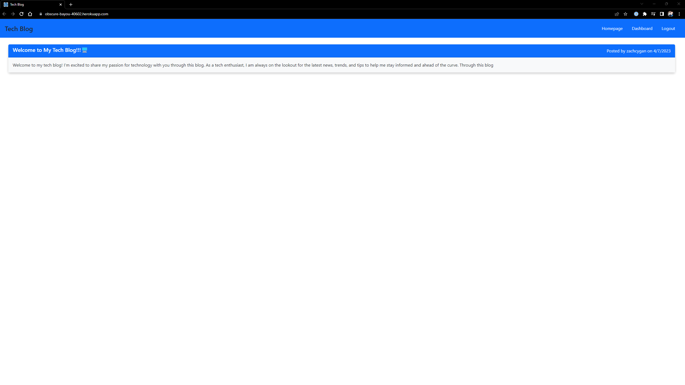
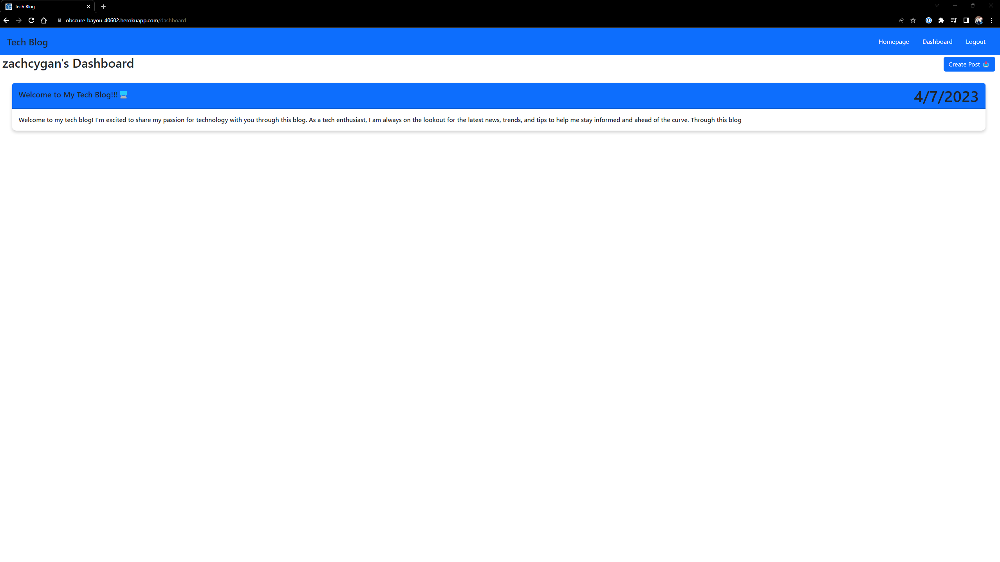
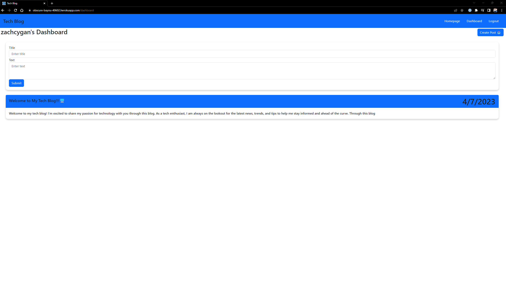
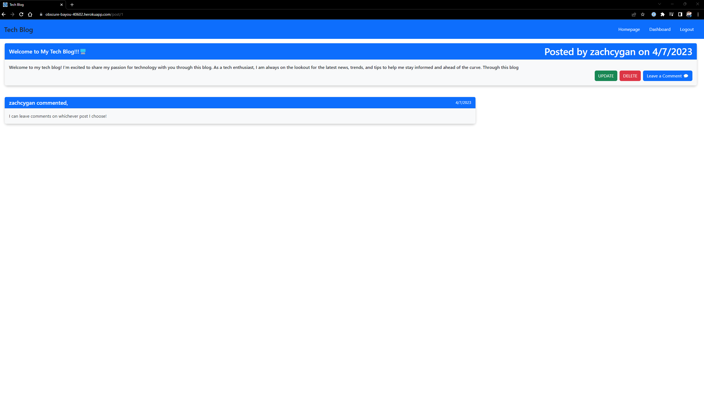

# Tech Blog

## Description

The purpose of this project was to build a blog that allowed users to interact and make posts on the website. It has authentation to save any posts that a single user makes. 

## Installation

The github repository is available at https://github.com/zachcygan/tech-blog. Be sure to install any dependencies by typing in "npm i" in the console.

## Dependencies Used
    - bcrypt
    - connect-session-sequelize
    - dotenv
    - express
    - express-handlebars
    - express-session
    - express-sessions
    - mysql2
    - sequelize

## Instructions

To begin making any posts on the site, the user must create an account. The website will automatically redirect any user to the login page if they try to perform an action that requires being logged in. For example, if they try to view a post, they must be logged in. Same applied to leaving comments. If the user does not have an account, they may simply click the link right about the login button to register. Once logged in, users will be able to make, comment, and view any posts. They may even update or delete an existing post if they created it. Note, that deleting a post will also delete any associated comments with that post. 

## Deployed Application

You can find the deployed application here: https://obscure-bayou-40602.herokuapp.com/

## Screenshots

